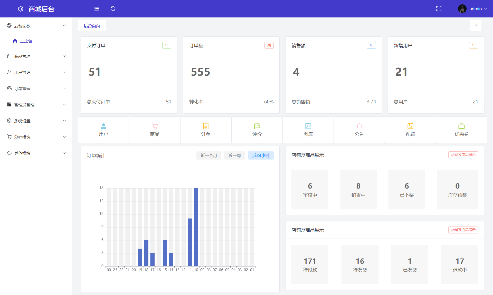

# 项目名称
商城后台管理系统
### 在线预览
https://luodedrong.netlify.app
-------------  
#### 简介:
vue-shop-admin 是一个商城后台管理系统,使用了最新的 Vue3、Vite、Element-Plus 等主流技术开发  

#### 相关预览


### 下载安装
- 获取项目代码:  
``` xml
git clone https://gitee.com/luo-derong/vue3-shop-admin.git
```
- 安装依赖:  
``` xml
cd vue-shop-admin
yarn install
```
- 运行:  
``` xml
yarn dev
```
- 打包:  
``` xml
yarn build
```
